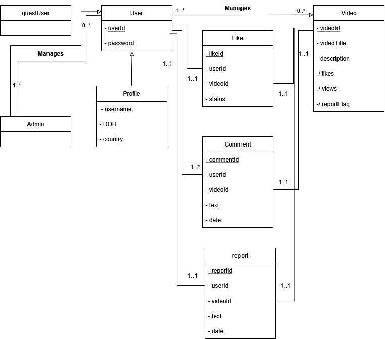

# Streamin 💧

As a fun summer project, I've decided to completely create a full stack video streaming platform called `Streamin`. The goal is to build a website where users can upload, share, and watch videos seamlessly. (Basically completely ripping off youtube)

As a fun bit, I'm going to make the website water/fluid based (Haha get it cause its called streaming). Anyways, this was inspired by learning about DASH in my computer networks course. I will be attempting to the best of my ability to follow proper software engineering protocols; all the way from requirements gathering up until CI/CD. If you think I made any mistakes, feel free to reach out to me.

# Table of Contents
1. [Introduction](#streamin-💧)
2. [Requirements Gathering](#requirements-gathering)
3. [Use Case Diagram](#use-case-diagram)
4. [Database Design](#database-design)
5. [Sequence Diagram](#sequence-diagram)
6. [System Architecture and Tech Stack](#system-architecture-and-tech-stack)
7. [UI/UX Prototype](#uiux-prototype)
8. [Implementation](#implementation)
9. [Testing and Quality Assurance](#testing-and-quality-assurance)
10. [Deployment and CI/CD](#deployment-and-cicd)
11. [Maintenance (maybe?)](#maintenance-maybe?)

## Requirements Gathering
### Functional Requirements
* Users should be able to create a new account by providing the necessary information.
* Users should be able to update their account details, such as contact information or password.
* Users should be able to like and comment on videos
* Users should be able to upload videos with relative ease.
* Users should be able to see videos that were uploaded by other users as well as their own videos.
* The platform should showcase videos from different users 
* The system should provide appropriate error messages and handle exceptions gracefully.
* Only users who uploaded their videos and admins can delete videos.
* Admins must provide a reason for taking down videos (e.g vioaltion of local laws)
* Guest users or users who aren't authenticated can only view videos. 

### Non-Functional Requirements
* The system should be scalable to handle a large number of users. For now, we limit this number to 50.
* The system should be secure to protect user data and privacy. All sensitive details like passwords must be encrypted within the database.
* The system should provide a fast and responsive user experience.
* The platform should support adaptive bitrate streaming.
* The website should be able to be loaded fully in 5 seconds. 

## Use Case Diagram

Use Case "Account Registration (C)"
1. Guest clicks on Login
2. Guest clicks on register account
3. Guest fills in data
4. Guest clicks agree to term and conditions
5. Guest clicks on submit
6. User gets redirected to profile page

Use Case "Login"
1. Guest clicks on Login 
2. Guest fills in username and password
3. Guest clicks login button
4. User redirected to home page

Use Case "Logout"
1. User clicks on profile page
2. User clicks on logout button
3. User logged out

Use Case "Edit Profile (U)"

1. User clicks on profile page
2. User clicks on edit details
3. User edits their details except for primary keys
4. User clicks save
5. System updates user profile in database
6. User is shown updated profile page

Use Case "Delete Profile (D)"

1. User clicks on profile page
2. User clicks on delete account
3. System prompts "Are you sure?" message
4. User clicks yes

Use Case "Upload Video (C)"
1. User clicks on Upload button
2. User selects a video file from device
3. User fills in title and description
4. User clicks submit
5. System uploads video file and generates a thumbnail
6. System saves video metadata in database
7. User is redirected to the video’s page

Use Case "Report Video (C)"

Use Case "Delete Video (D)"

Use Case "Search Videos (R)"

Use Case "Like Video (C)"

Use Case "Add Comment (C)"

Use Case "Delete Comment (D)"

## Database Diagram

